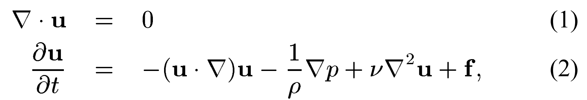

# 2D Fluid Simulation

An Eulerian 2D fluid simulation which numerically solves the 
full Navier-Stokes equations for an incompressible fluid.

## Screen Recording
<i>GIF showing the density of a substance (ex. smoke or dye) being transported in a fluid</i>

<i>GIF showing the two visualisation modes: density and velocity</i>


## Installation and Setup Instructions

### Requirements
- Java 21 JDK (`openjdk-21-jdk` or equivalent)
- Maven 3.8+

### Build
```bash
mvn package
```

### Test
```bash
mvn test
```

### Run
```bash
mvn javafx:run
```

## Mathematical Context
Given that the velocities and pressures are known at \( t = 0 \),  
their evolution over time is governed by the incompressible  
Navier–Stokes equations:




These equations are obtained by imposing that the fluid conserves both mass (Eq. 1) and momentum (Eq. 2). Because of their inherent nonlinearity,
numerical methods are the most common way to solve these equations.

The algorithm used to solve the Navier-Stokes equations for this project was proposed by Jos Stam in his paper Stable Fluids.
```pseudocode
while (simulating):
    handle display and user interaction
    vStep(visc, F, dt)
    sStep(kS, aS, velocities, dt)
```

I only add forces with mouse interaction, and I have ignored substance diffusion and dissipation for now, so this simplifies to:
```pseudocode
while (simulating):
    handle display and user interaction
    vStep(visc, dt)
    sStep(velocities, dt)
```

With vStep and sStep being:
```pseudocode
vStep(visc, dt):
    advect(dt)
    diffuse(dt, visc)
    project(dt)

sStep(velocities, dt):
    advect(velocities, dt)
```

### Advection
I solve advection using the Semi-Lagrangian method. The key idea of this method
is that, instead of pushing fluid forward in time, we trace backwards. This method
is preferred because it is unconditionally stable.

### Diffusion
The simulation does already have a diffusion effect due to numerical interpolation and large timesteps.
However, we further control this by updating velocities based on the diffusion equation.

$$
\frac{\partial v}{\partial t} = \upsilon \nabla ^2v
$$

I solve this equation using Gauss-Seidel iteration.

### Projection
The projection step ensures that the velocity field is divergence free, so it satisfies
equation 1. To solve this equation, I first solve for the pressures of each grid cell using
Gauss-Seidel iteration, then update the velocities based on the pressure gradients between
grid cells. This ensures that fluid flows from higher pressures to lower pressures.

## Reflection

### Project Goal
I wanted to build upon my knowledge of Java, fluid mechanics, and  computer graphics to create something visually impressive and (mostly) physically accurate.

### Areas for Improvement
1. Java is of course not the best language for writing a fluid simulation (C or C++ are more commonly used for performance and GPU integration). Still, I chose it because I wanted more practice with Java.
2. Using a different numerical method to Gauss-Seidel iteration. I chose this method because I understood it, and it was easy to implement in code. However, there are faster methods to solve sparse linear systems.
3. Reducing the number of expensive array copying operations in the diffusion and advection steps. A potential way to do this is to store two velocity grids, previous and current, and swap the pointers instead of array copying.
4. Optimizing the code to run to compute in parallel for GPU. For example, the pressures can be solved using the red-black Gauss-Seidel method.
5. Further refactoring. There is some duplicate logic, especially for looping over arrays, that could be further refactored. I plan to do this when I have more time.

## Works Cited
[1] J. Stam, “Stable fluids,” Proceedings of the 26th annual conference on Computer graphics and interactive techniques  - SIGGRAPH ’99, 1999, doi: https://doi.org/10.1145/311535.311548.

[2] Sebastian Lague, “Coding Adventure: Simulating Smoke,” YouTube, Oct. 11, 2025. https://www.youtube.com/watch?v=Q78wvrQ9xsU (accessed Nov. 19, 2025).